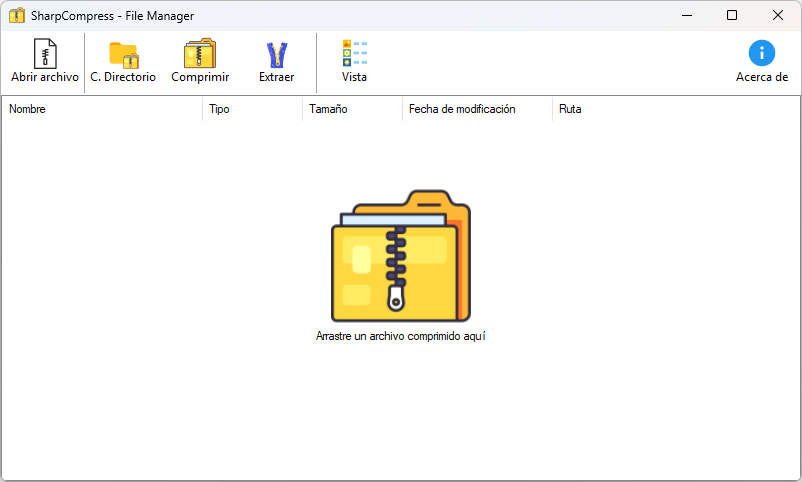

# SharpCompress

Pequeño y completo compresor y extractor de archivos desarrollado 100% en el lenguaje de programación C#

[Descargar Instalador]

[Descargar](https://github.com/KrDev0/SharpCompress/releases/download/Release1.2/SharpCompress1.2.exe)

1- Ejecute el archivo .msi para instalar el compresor

Actualización 1.2

Actualización de la interfaz y mejoras en la compresión

Se ha cambiado el icono de la aplicación y se han añadido nuevas referencias a bibliotecas en `7ZipSharp.csproj`. Se han implementado nuevas clases y métodos para mejorar la funcionalidad de compresión y extracción de archivos, incluyendo la adición de un `ListView` para gestionar archivos y un menú contextual para facilitar la interacción del usuario.

Se han añadido múltiples archivos de registro para integrar la aplicación con el menú contextual de Windows, permitiendo a los usuarios comprimir y extraer archivos directamente desde el explorador. También se han actualizado los recursos de la interfaz de usuario, incluyendo nuevos iconos y gráficos, así como la implementación de una ventana "Acerca de" para mostrar información sobre la aplicación.

Además, se ha creado un nuevo proyecto de biblioteca `ContextMenu` y se han realizado cambios en `AssemblyInfo.cs` para reflejar la nueva versión del software.

